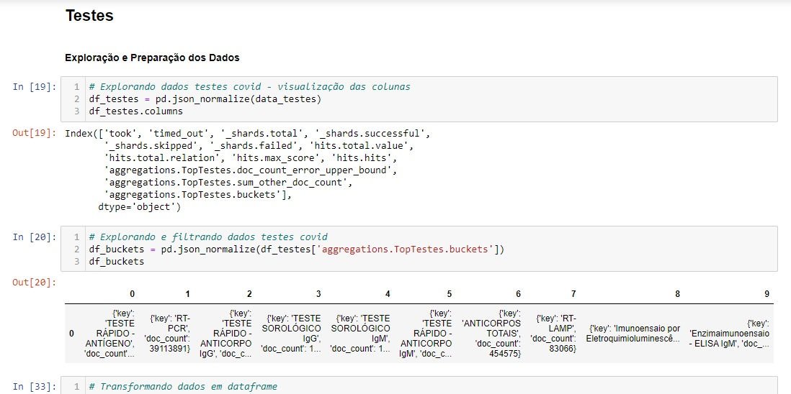
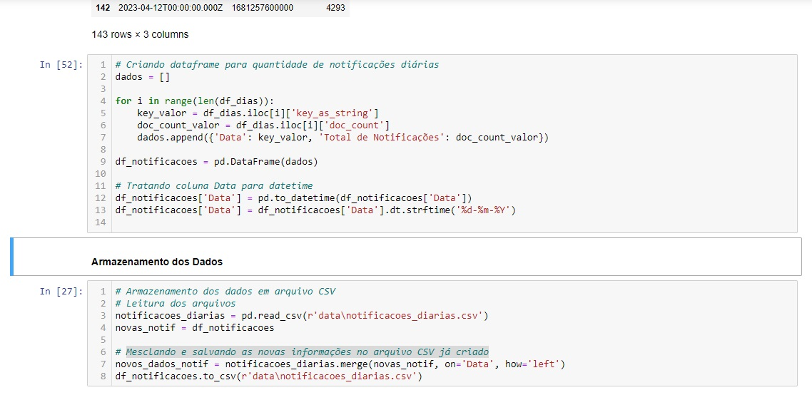
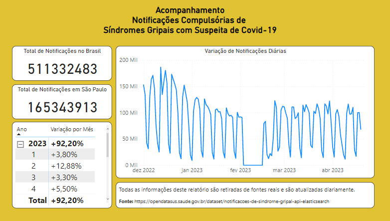

# Notificações Compulsórias de Síndrome Gripal associado ao Covid-19 no Brasil
A pandemia de COVID-19 é uma crise global de saúde pública que teve início em 2019 e continua afetando o mundo até o momento. Causada pelo coronavírus SARS-CoV-2, a doença foi inicialmente identificada em Wuhan, na China, e se espalhou rapidamente para outros países, levando à declaração de uma pandemia pela Organização Mundial da Saúde (OMS). A COVID-19 tem apresentado uma série de desafios, incluindo altas taxas de transmissão, gravidade variável dos sintomas e impactos significativos na saúde pública, economia e sociedade em geral. As medidas de controle e prevenção têm incluído isolamento social, uso de máscaras, higienização das mãos, desenvolvimento e distribuição de vacinas, além de esforços internacionais de colaboração para combater a propagação do vírus e minimizar os impactos da pandemia.

A pandemia de COVID-19, devido à sua magnitude e impacto global, tem levado as autoridades de saúde em muitos países a adotarem a notificação compulsória de doenças como parte de suas estratégias de vigilância epidemiológica. Ela é necessária para garantir a detecção precoce, o monitoramento e o controle de doenças que possam representar um risco à saúde pública.

No Brasil, realizamos a notificação compulsória da Síndrome Gripal com suspeita de COVID-19. Os dados gerados pelas notificações são armazenados na API do OpenData SUS (Elastic Search). 
A partir da ingestão desta API será realizada uma análise inicial para compreender a ferramenta e, então, serão realizados a exploração, o tratamento e o armazenamento dos dados tratados. Esses dados serão analisados e serão apresentados a partir de tabelas e gráficos. 

* Sobre a API
O Elasticsearch é um mecanismo de busca e análise distribuído, de código aberto, que permite armazenar, buscar e analisar grandes volumes de dados de forma eficiente e em tempo real. É comumente utilizado para indexar e pesquisar dados em tempo real, como logs, métricas, dados de aplicativos e muito mais. 

A API do Elasticsearch permite interagir com o Elasticsearch usando várias linguagens de programação, como Python, Java, PHP, entre outras. A API aceita solicitações HTTP e responde com dados em formato JSON. O JSON (JavaScript Object Notation) é um formato de dados leve, legível por humanos e amplamente utilizado para representar dados estruturados. É uma notação de valor-chave, onde os dados são representados em pares de chave e valor, que podem ser aninhados em estruturas hierárquicas. 

## Ferramentas Utilizadas

Desenvolvido com: 
<li>Anaconda, https://www.anaconda.com/;</li>
<li>Notebook Jupyter, https://jupyter.org/</li>
<li>Utilizada linguagem Python 3.9, instaladas Bibliotecas Pandas, Matplotlib, Json, Requests, Datetime;</li>
<li>Dados das notificações compulsórias de Síndromes Gripais, https://opendatasus.saude.gov.br/dataset/notificacoes-de-sindrome-gripal-api-elasticsearch;</li>
<li>Postman, https://www.postman.com/</li>

## Acessando o Projeto

1. Anaconda/ Jupyter 

Clonar este repositório para o seu Github. 
Importar o repositório para uma pasta de seu computador. 
Realizar a instalação do programa Anaconda, instalar o Python 3.9 e, dentro de Anaconda Navigator, realizar o download do Jupyter. 

No prompt do Anaconda, realizar o download das bibliotecas Pandas, Matplotlib, Json, Requests, Datetime. 
Abrir Jupyter Notebook no Anaconda. 
Procurar pela pasta do repositório. 
Abrir o arquivo 'SindromeGripal_API.ipynb', 
Apertar em 'RUN'. 
Após este passo, o programa irá rodar todos o projeto. 

2) Google Colab 

Caso não deseje clonar todo esse repositório, também será disponibilizado um arquivo do tratamento de dados no Google Colab. 
Você só precisará clicar no link abaixo e clicar em "Ambiente de execução" e, em seguida, "Executar tudo". 

 

## Passo a Passo

1. Definição do Problema 
2. Obtenção dos Dados 
3. Exploração dos Dados 
4. Preparação dos Dados 
5. Armazenamento dos Dados 
6. Apresentação dos Dados 

### 1. Definição do Problema &check;
Devido ao início do outono brasileiro em 2023 e a melhora aparente dos casos de COVID-19, surge a preocupação com o aumento de casos de Covid-19 neste ano.
Será preciso utilizarmos máscara novamente para ir ao mercado? 
Será que é seguro sairmos para as festas? 
Será que é preciso nos atentarmos novamente com a ventilação dos ambientes? 
Posso cumprimentar as pessoas com beijo no rosto? 

Todas essas questões remetem à preocupação do retorno do Covid-19 e um cuidado com nossos entes queridos...

Para acompanharmos estas dúvidas, colocamos como questões da pesquisa: 
* Questões Principais: 
<li> Quantas são as notificações diárias dos casos de síndrome gripal neste momento: no Brasil e em São Paulo?</li>
<li> Será que haverá um aumento de notificações de síndrome gripal associadas ao Covid-19 com a chegada do tempo frio? </li>

* Questões secundárias: 
<li> Quais são os principais sintomas apresentados no momento?</li>

### 2. Obtenção dos Dados &check;
Os dados serão coletados a partir da API do Elastic Search: https://opendatasus.saude.gov.br/dataset/notificacoes-de-sindrome-gripal-api-elasticsearch 

Para aprender sobre a utilização desta API foi necessário procurar por outras fontes além da documentação do Elastic Search, dentre eles:
* Documentação Elastic Search: https://www.elastic.co/guide/en/elasticsearch/reference/current/search-request-body.html
* Manual da API da Campanha Nacional de Vacinação da Covid-19, https://opendatasus.saude.gov.br/dataset/covid-19-vacinacao/resource/84707ab9-8497-4f2f-8a0d-b873489a63bf
* MANUAL DE INTEGRAÇÃO - e-SUS NOTIFICA, https://datasus.saude.gov.br/wp-content/uploads/2022/02/Manual-de-Utilizacao-da-API-e-Sus-Notifica.pdf
* Dicionário de Dados, https://opendatasus.saude.gov.br/dataset/notificacoes-de-sindrome-gripal-api-elasticsearch/resource/9a2632b2-65b5-4fb0-89d8-2d421e34d4d5

O OpenData SUS recomenda que seja utilizado o site Postman para realizar a ingestão da API. 
Neste projeto, o site foi utilizado por vezes para realizar a tradução da requisição para a linguagem Python e obtenção dos dados. Contudo, não foi utilizado em nenhuma outra etapa. A biblioteca pandas da linguagem Python foi a responsável pela importação dos dados para o notebook Jupyter e por toda a exploração, tratamento e armazenamento dos dados. 

### 3. Exploração dos Dados &check;
Após realizar a extração dos dados da API para o Jupyter, foi iniciada a fase de exploração dos dados. 
Nesta fase, a biblioteca Pandas será utilizada para realização da análise exploratória dos dados. 

### 4. Preparação dos Dados &check;
Nesta fase, os dados serão tratados e filtrados baseados nos problemas colocados anteriormente. Primordialmente, biblioteca pandas será utilizada nesta fase.  

### 5. Armazenamento dos Dados &check;
Nesta fase, será realizado o armazenamento dos dados em um arquivo CSV para que seja possível realizar a apresentação dos dados posteriormente. 

### 6. Apresentação dos Dados &check;
A apresentação dos dados será realizada a partir de um arquivo Power BI. 

### Andamento do Projeto
Entregue. 

